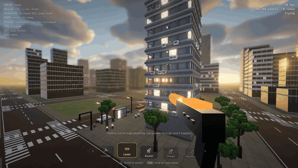

# three-voxel-destruction

A Teardown-inspired voxel destruction demo in Three.js (WebGPU): every voxel a body in
[three-avbd](https://github.com/sbobyn/three-avbd)'s GPU rigid-body solver. Three scenes, picked
from the bar at the top:

- **City**: a city block of 94,000 voxels. Hammer it, cut it with a laser, blow it up with
  rockets and charges, or throw a wrecking ball. Storeys give way when what carries them is cut,
  glass shatters, and rubble settles and freezes.
- **Race track** (`?scene=track`): a supercar on a circuit whose walls, stands and tyre stacks
  are all voxels. Drive through them, drift it on the handbrake, fire its rockets and machine
  guns; it takes damage where it's hit and, wrecked, goes up.
- **Space station** (`?scene=space`): a station in orbit with no gravity, over an Earth with
  volumetric clouds. Cut a solar wing loose and it drifts off; blow a module apart and it
  scatters into the dark.

**Play it: [three-voxel-destruction.vercel.app](https://three-voxel-destruction.vercel.app)**



Needs a browser with WebGPU: Chrome or Edge, or Safari on iOS 26 and macOS 26. It runs on
phones and tablets too, with thumb sticks. On the first load of each scene it times your GPU
and picks the quality and how many loose pieces the physics carries, so a collapse holds 60 fps
(Graphics in the menu overrides it; Re-tune measures again).

## Controls

| | |
|---|---|
| Mouse | look; left click uses the tool, right click aims |
| WASD | move; Space / E up, Q / C down (flying), Shift fast, Alt slow |
| Scroll, or hold Tab | switch tools: hammer, laser, rocket, charge, wrecking ball |
| F | fly or walk (walking: Space jumps, C crouches, Shift sprints) |
| X | slow motion |
| T, R | time of day, reset the scene |
| Esc | menu (sensitivity, field of view, graphics, sound) |

In the car (the race track):

| | |
|---|---|
| W / S | throttle; brake, then reverse |
| A / D | steer |
| Space | handbrake |
| B | boost |
| Left / right click | rockets / machine guns |
| F | get out (and back in, by the car) |

## Running it

```sh
pnpm install
pnpm dev        # http://localhost:5320
pnpm check      # typecheck, tests (GPU ones through Dawn), build
```

Needs a browser with WebGPU. The labs, `sky-lab.html` and `particles-lab.html`, tune the sky
and the particles on their own.

## three-avbd

It uses the solver through `three-avbd/advanced` (`GpuSolver3D` and the buffer layouts), since
it runs its own compute pass over the bodies (blasts). It depends on the published package
(`three-avbd` on npm). To work on both at once, link a checkout: `pnpm link ../three-avbd`
(after `pnpm build:lib` there).

The city is z-up (the solver's `up` is set to `REF_UP`).

## Credits and license

Textures and skies: [Poly Haven](https://polyhaven.com), CC0 (see `public/textures/CREDITS.md`
and `public/hdri/CREDITS.md`). The Earth: NASA's Blue Marble, public domain
(`public/space/CREDITS.md`); its clouds are procedural, the volumetric cloud layer from
web-gpu-gems (`src/clouds`). The code is MIT (`LICENSE`).
